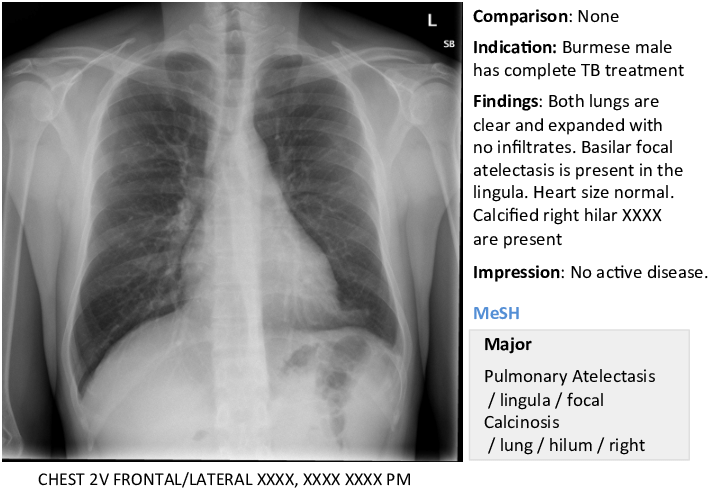

# Natural Language Entity Extraction
Extracting Ground Truth Labels from Radiology Reports

In this project you'll learn to extract information from unstructured medical text. In particular, you'll learn about the following topics:

- Extracting disease labels from clinical reports
    - Text matching
    - Evaluating a labeler
    - Negation detection
    - Dependency parsing
- Question Answering with BERT
    - Preprocessing text for input
    - Extracting answers from model output 

This work is inspired by the [work](https://arxiv.org/abs/1901.07031) done by Irvin et al.

<a href="https://ieeexplore.ieee.org/document/7780643">Image Credit</a>

You can read the notes for the theoretical background required for this project: [link](https://github.com/numanai/Natural-Language-Entity-Extraction/blob/master/Medical%20Q%26A.pdf)
